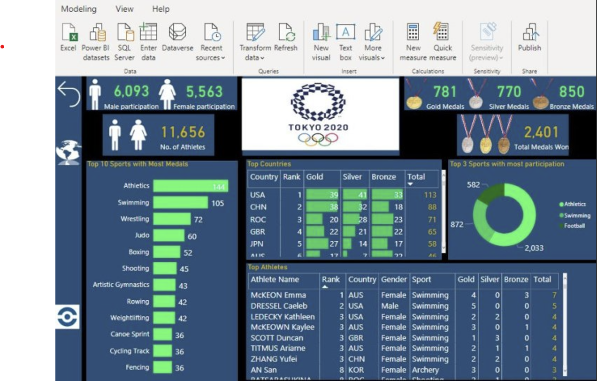

# Sports-Player-Strength-Analysis

## The Brief
A professional sports team wanted to optimize their training strategies and improve player performance by analyzing various metrics such as strength, endurance, agility, and injury history. The team lacked a unified platform to track and visualize player performance across these dimensions, hindering their ability to make informed decisions. As a solution, the coaching staff decided to integrate data analytics into their workflow to gain insights into player strengths and weaknesses.

## Task
As a data analyst, I was provided with sample player data, including metrics on physical performance and health, and tasked with creating an interactive dashboard. The goal was to visualize player strength analysis to help coaches make data-driven decisions on training adjustments, player selection, and injury management.

## What I Learned
- The data provided consisted of multiple CSV files containing player performance metrics, training progress, and injury details.
- Data cleaning and transformation were carried out to ensure accuracy, including handling missing values, normalizing performance data, and deriving new metrics.
- Built a relational data model by establishing active relationships between tables (e.g., Player Data, Training Data, Injury History) while ensuring correct cardinality and filter flow.
- Designed an interactive dashboard in Power BI, incorporating various visuals such as bar charts, line charts, and heat maps to track player strength across different categories.
- Created a custom visual using a **Radar Chart** to compare player performance across multiple strength indicators (e.g., speed, endurance, agility).
- Implemented drill-through functionality and dynamic filters to allow coaches to gain deeper insights into individual player performance.
- Added custom tooltips to enhance the user experience and provide additional context on performance trends.

